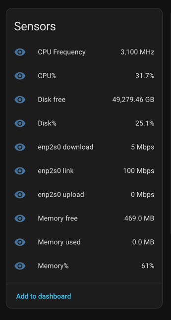

# mqstats

**mqstats** is a utility that publishes host's resource metrics to MQTT for Home Assistant.

It utilises `psutil` Python package to acquire system resources and publishes them to MQTT topics.

**mqstats** automatically discovers itself and all its topics to Home Assistant using [MQTT discovery](https://www.home-assistant.io/integrations/mqtt/#mqtt-discovery) feature.

Simply run **mqstats** on your host, give network access to MQTT broker (e.g. mosquitto) and receive metrics in Home Assistant dashboard. No network / SSH access to host required!



## Running as systemd service

Service template is located in [mqstats.service](mqstats.service) file

You need to download **mqstats** (e.g. in `/opt/mqstat`), setup 
config file in `/etc/default/mqstats` by default, copy `mqstats.service` to 
`/etc/systemd/system/mqstats.service` (or user systemd directory) and start it.

```shell
# clone repository, install requirements and setup systemd service files
git clone https://github.com/theevilroot/mqstats /opt/mqstats
cd /opt/mqstats/
python3 -m venv venv
source venv/bin/activate
pip3 install -r requirements.txt
cp sample.env /etc/default/mqstats
cp mqstats.service /etc/systemd/system/mqstats.service

# edit /etc/default/mqstats to set correct values
vim /etc/default/mqstats

# enable autostart and start service
systemctl daemon-reload
systemctl enable mqstats
systemctl start mqstats

# read logs
journalctl -u mqstats.service
```

> For debian based systems you'll need to have `python3-venv` and `python3-pip` packages installed. Alternatively, install packages from `requirements.txt` manually into system python packages and remove use of virtual environment from service file. 

Following configuration variables are present in `/etc/default/mqstats`

```dotenv
MQSTATS_DEVICE_NAME=vps_1 # device name, defaults to hostname
MQSTATS_BASE_TOPIC=mqstats # base topic for MQTT (e.g. mqstats/{device_id}/{sensor_id}), defauts to mqstats
MQSTATS_NICS=en3,en1,en2,en0,en4 # list of nics to acquire stats for, see `ip link`. defaults to empty list

MQSTATS_MQTT_HOST=localhost # mqtt broker hostname
MQSTATS_MQTT_PORT=1883 # mqtt broker 
MQSTATS_MQTT_USERNAME= # mqtt broker username if auth is required. defaults to empty
MQSTATS_MQTT_PASSWORD=# mqtt broker password. only used if username is not empty
MQSTATS_SENSOR_INTERVAL=2 # metrics collection interval in seconds
```